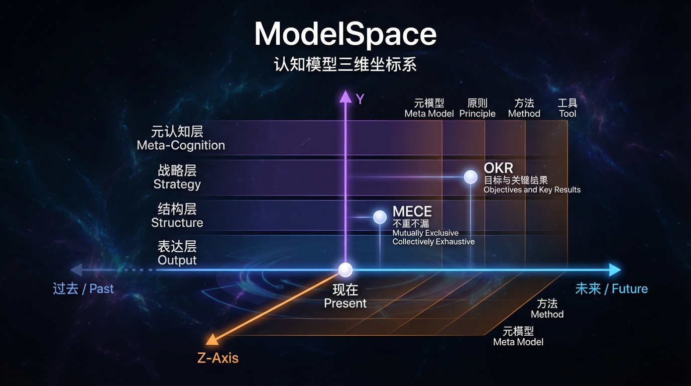

# ModelSpace

[](LICENSE)



A frontend-only 3D visualization of cognitive models, mapping them along **X (time-orientation) × Y (control depth) × Z (abstraction level)**. Browse, filter, and inspect model details in an interactive Three.js scene.

---

## ✨ Features

- **3D coordinate layout**: Models positioned by time-orientation, control depth, and abstraction level
- **Interactive scene**: Orbit controls (rotate, zoom, pan) with grid and axis labels
- **Filtering**: Filter by category, dimension values, and text search
- **Detail panels**: Expandable model details with evidence bundles, references, and admission metadata
- **Learning flow**: Cell-focus learning path and related-model grouping in details
- **Shareable state**: URL query keeps language, view, filters, and panel state for sharing
- **Embed mode**: Lightweight embedded entry (`embed.html`)
- **i18n**: Chinese and English support
- **CI validation**: GitHub Actions runs structure + content validation, E2E regression, and perf budget on push/PR; **failures block merge**

---

## 📦 Installation

No build step. Requires a static HTTP server and a modern browser.

**Requirements**: Python 3.x (for `http.server`) or Node.js (for `npx serve`), or any static file server.

---

## 🚀 Quick start

```bash
git clone https://github.com/NESNILNEHC/ModelSpace.git
cd ModelSpace
python3 -m http.server 8000
```

Open [http://localhost:8000](http://localhost:8000). The index redirects to the 3D view (`cognitive-model-3d.html`).

### Deploy to GitHub Pages

1. Push the repo to GitHub.
2. Go to **Settings → Pages**.
3. Source: **Deploy from a branch**.
4. Branch: `main`, folder: `/ (root)`.
5. Save. The site will be at `https://nesnilnehc.github.io/ModelSpace/`.

No build step needed. The project uses relative paths, so it runs correctly under the project subpath.

---

## 📖 Usage / configuration

- **View presets**: Top/front/side views from the dock
- **Filters**: Use the control panel to filter by category, dimensions, or text
- **Details**: Click a model node to open the detail panel
- **Language**: Switch between 中文 and English in the UI
- **State sharing**: Copy browser URL to share current view/filter/language state

### Embed mode

- Open `http://localhost:8000/embed.html` for a simplified embedded view
- You can still pass query parameters (they are merged with `simple=1&embed=1`)

### Maintenance commands

```bash
# Validate model data - structure (same as CI)
npm run validate

# Validate model data - content governance (same as CI)
npm run validate:content

# Generate changelog lines from git diff (when editing model-library.js)
npm run changelog:diff

# Run E2E regression checks (i18n, filters, cell focus, related jumps, URL restore, embed, export)
npm run smoke:e2e

# Run perf budget baseline on 100+ nodes (first-screen, FPS, export latency)
npm run perf:budget

# Export promo image for README (start server first, e.g. python3 -m http.server 8080)
npm run export-promo

# Remove local temp screenshots
rm -f .tmp-*.png
```

To update the promo image: run `npm run export-promo` (with the server running on port 8080), or open the 3D view, click **推广图视角** and **导出图片**, then save as `docs/assets/modelspace-promo.png`.

### Project structure

| Path | Purpose |
|------|---------|
| `index.html` | Entry redirect to 3D view |
| `cognitive-model-3d.html` | 3D page shell, layout, importmap |
| `data/model-library.js` | Model data, evidence bundles, references |
| `src/app.js` | Main app logic (render, filters, details, i18n) |
| `src/layout.js` | Layout engine (coordinates, labels) |
| `src/app3d/*.js` | Reusable modules (i18n, filters, scene, interaction, export, URL state, detail orchestration) |
| `scripts/validate-model-data.mjs` | Data validation script |
| `docs/` | Classification standards, architecture, design docs |

See [docs/project-overview/project-file-map.md](docs/project-overview/project-file-map.md) for the full file map.

---

## 🤝 Contributing

1. Fork the repository
2. Create a feature branch
3. Run `npm run validate`, `npm run validate:content`, `npm run smoke:e2e`, and `npm run perf:budget` before committing
4. If you changed `data/model-library.js`, update `docs/changelog/model-library-changelog.md`
5. Open a pull request

**CI gates:** Structure validation, content governance validation, E2E regression, and perf budget all run on push/PR. Any failure **blocks merge**.

---

## 📄 License

[LICENSE](LICENSE) (MIT). See the LICENSE file for details.

---

## 👤 Authors and acknowledgments

- **NESNILNEHC** – ModelSpace, cognitive model 3D visualization
- Three.js (vendored) – 3D rendering
- See `docs/` for classification standards and design decisions
